# CS506Project-Boston-Airbnb-Pricing-Prediction

## Proposal
[View the project proposal](Proposal.md)

## 1. Build and Run

### Prerequisites

- Python 3.10+
- `pip`

### Quickstart

```bash
git clone https://github.com/99Niki/CS506Project-Boston-Airbnb-Pricing-Prediction.git
cd CS506Project-Boston-Airbnb-Pricing-Prediction
make install       # create venv and install all dependencies
make data          # download listings.csv from Inside Airbnb
make run           # execute the notebook end-to-end
make test          # run the test suite
```

### Tests and CI

Tests live in `tests/test_pipeline.py` and cover the most critical invariants of the pipeline. 


## 2. Data Collection

**Source:** [Inside Airbnb](http://insideairbnb.com/get-the-data/),an open-source project that collects quarterly information about Airbnb listings across different cities and countries via web scraping and makes it available for the public. Specifically, we use the `listings.csv` for Boston Massachusetts, scraped on September 23, 2025.

Inside Airbnb scrapes publicly visible Airbnb listing pages and publishes structured CSV snapshots. The Boston dataset contains detailed listing-level information including pricing, host attributes, location, property characteristics, amenities, and guest review scores.

**Raw dataset:** ~ (4419,79)

The dataset was chosen because it provides a rich mix of numeric, categorical, and text features relevant to price prediction, and it is a well-understood benchmark for short-term rental price modeling.


## 3. Data Processing

### 3.1 Initial Data Inspection
We began by examining the dataset structure, data types, and missing values.
- Dataset size: 4,419 rows × 79 columns
- Mixed data types: numerical, categorical, and text
- Significant missing values observed in multiple columns

| Feature | Missing Value |
|---|---|
| `calendar_updated` | 4419 |
| `neighbourhood_group_cleansed` | 4419 |
| `price` | 913 |
| `beds` | 869 |
| `bathrooms` | 864 |
| `bedrooms` | 305 |
| `host_is_superhost` | 229 |
| ... | ...   |


**Dropping Irrelevant and Redundant Columns**
- Scraping / metadata fields: `scrape_id, last_scraped, calendar_last_scraped, source`
- Identifiers and URLs: `id, listing_url, picture_url`
- Low-value textual features: `name, description, license`
- Fully empty columns:`calendar_updated,neighbourhood_group_cleansed`
- Derived or redundant metrics: `estimated_revenue_l365d, estimated_occupancy_l365d`


### 3.2 Price Cleaning and Transformation

#### a. Data Type Conversion
The `price` feature was converted from string format to numeric to enable quantitative analysis and modeling.

#### b. Distribution Analysis

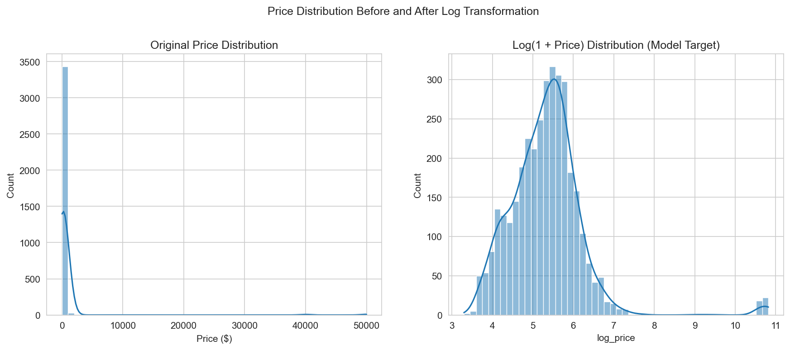

- Price skewness: **9.30** (highly right-skewed)  
- Log price skewness: **2.17**  

To reduce skewness and stabilize variance, we applied a log transformation:

`log_price =log(1 + price) `

This transformation compresses extreme values and makes the distribution more suitable for modeling.

#### c. Outlier Removal (IQR Method)
Outliers were removed using the Interquartile Range (IQR) method, resulting in **3416 remaining observations**.

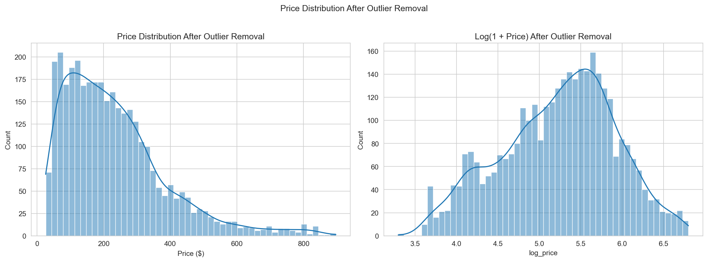

Skewness improved significantly:
- Price: **1.31** (still moderately skewed)  
- Log price: **≈ -0.26** (approximately symmetric)


### 3.3 Host Feature Processing

#### a. Data Type Conversion
- Percentage fields → converted to numeric (float)
- Boolean fields (t/f) → encoded as binary (0/1)

#### b. Relationship with Price

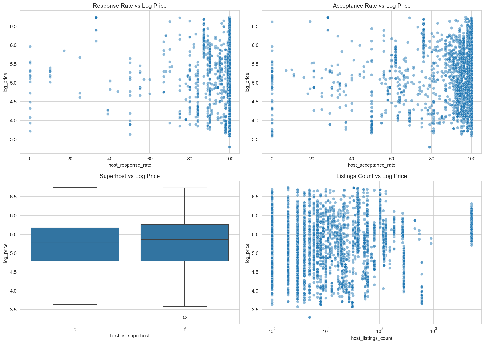

Most host-related features show weak or negligible relationships with `log_price`.

#### c. Feature Selection
- Dropped: profile details, verification fields, listing counts, and response metrics  
- Retained: `host_is_superhost`


### 3.4 Minimum and Maximum Nights

#### a. Data Exploration

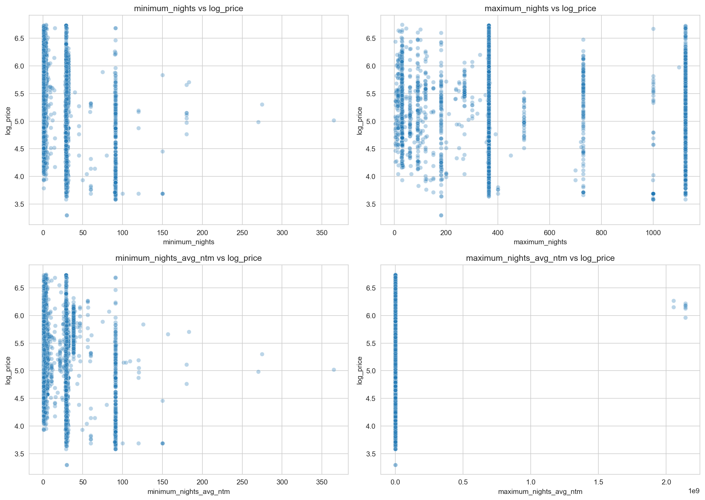

- Weak relationship with price  
- High redundancy across variables  

#### b. Feature Engineering: `is_short_stay`

`is_short_stay = 1 if minimum_nighrs <=2, otherwise 0`

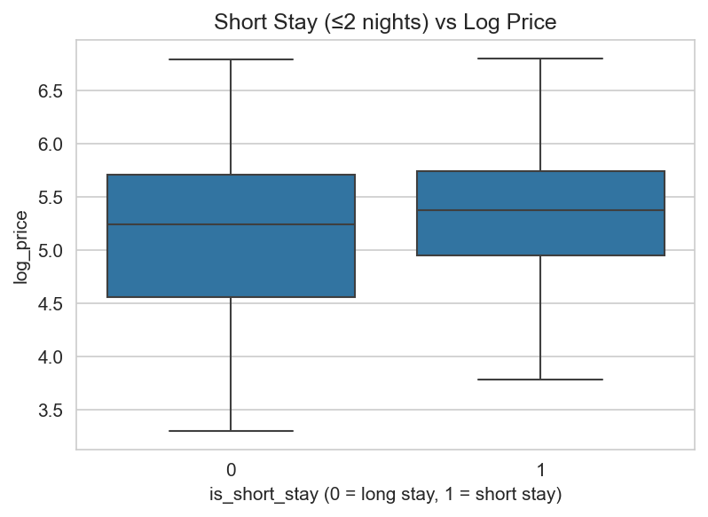

The original night related features showed minimal predictive value and introduced redundancy. Instead, the engineered binary feature `is_short_stay` captures a meaningful behavioral pattern (short term vs long term stays) and shows a slightly stronger relationship with pricing.


### 3.5 Availability Features

#### a. Data Exploration

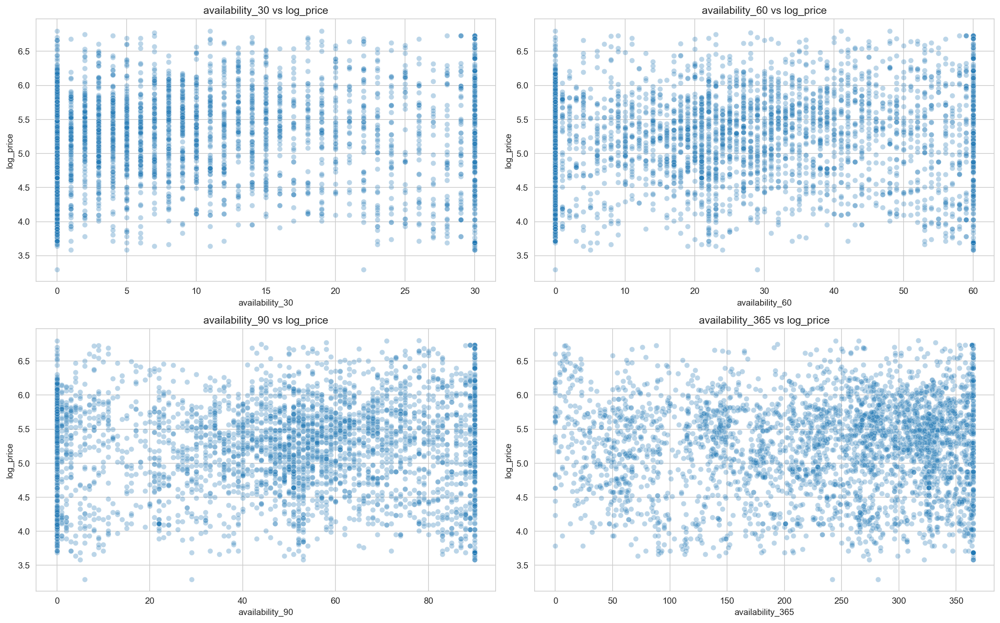

- Strong correlation among availability variables  
- Weak relationship with price  

#### b. Data Cleaning
- Dropped: short-term availability features (`availability_30`, `availability_60`, `availability_90`)  
- Retained: `availability_365`

Keeping only `availability_365` reduces redundancy while preserving long-term availability information.


### 3.6 Review Features

#### a. Data Exploration

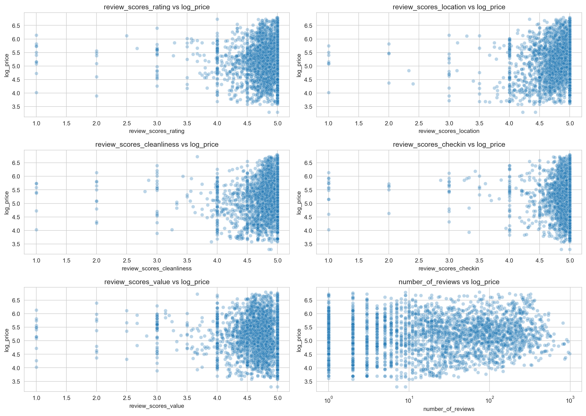

- Review scores are tightly clustered (mostly between 4 and 5)  
- Minimal variation limits their predictive power  
- Relationships with `log_price` are weak and highly similar across features  

However, `number_of_reviews` shows a wider distribution and may capture listing popularity or maturity.

**b. Data Cleaning**
- Dropped: detailed review scores and time-based review metrics  
- Retained: `number_of_reviews`

This retains a meaningful signal while removing redundant and low-variance features.


### 3.7 Property and Room Type

#### Room Type

| Room Type        | Count |
|------------------|------:|
| Entire home/apt  | 2443  |
| Private room     | 965   |
| Hotel room       | 5     |
| Shared room      | 3     |

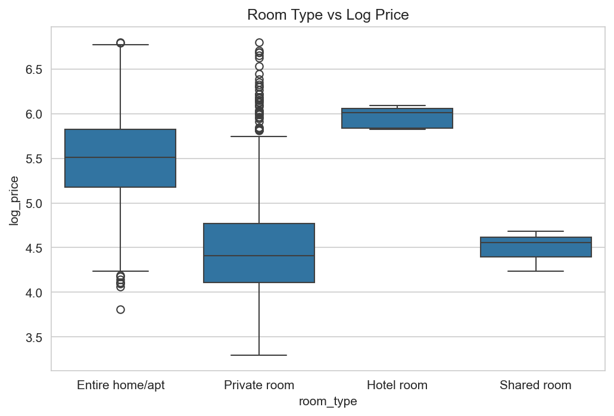

The dataset is dominated by **entire homes/apartments** and **private rooms**, while hotel and shared rooms are extremely rare. From the plot, entire homes tend to have higher prices compared to private rooms, indicating that room type is an important factor influencing pricing.

#### Property Type (Raw)

The original `property_type` feature is highly diverse, with many granular categories and a long tail of rare property types.

| Property Type                         | Count |
|-------------------------------------|------:|
| Entire rental unit                  | 1862  |
| Private room in rental unit         | 463   |
| Private room in home                | 292   |
| Entire condo                        | 227   |
| Entire home                         | 170   |
| ...                                 | ...   |
| Tiny home                           | 1     |

This high cardinality introduces sparsity and makes the feature less suitable for modeling in its raw form.


#### Property Type (Cleaned)

To address sparsity, we grouped similar categories into broader, more meaningful groups:
`apartment, house, condo, townhouse, hotel, loft, guest_space, other`.

| Property Type (Cleaned) | Count |
|------------------------|------:|
| apartment              | 2403  |
| house                  | 532   |
| condo                  | 281   |
| guest_space            | 73    |
| hotel                  | 65    |
| other                  | 43    |
| loft                   | 19    |

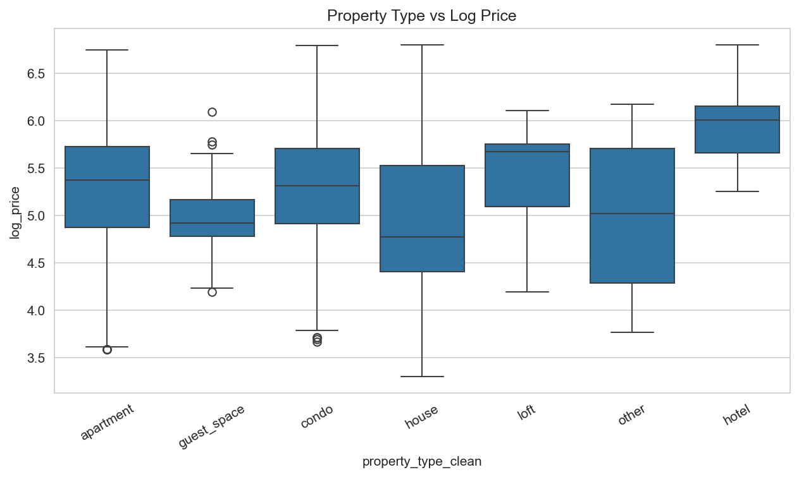

After cleaning, the feature becomes more balanced and interpretable. The plot shows noticeable price variation across property types, confirming that this feature is useful for predicting listing prices.


### 3.8 Bathroom Feature Engineering

#### a. Data Exploration

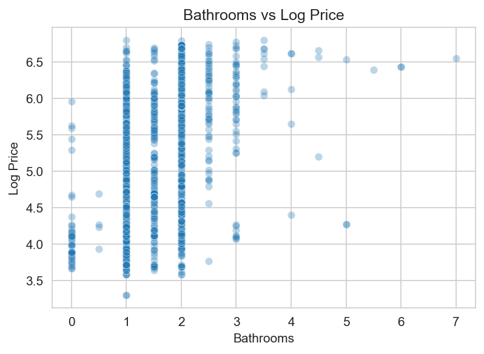

The dataset contains two related features: `bathrooms` (numeric) and `bathrooms_text` (string). Since both represent similar information, we retain the numeric `bathrooms` feature for modeling due to its structured format.

However, the `bathrooms` variable is highly discrete and skewed (with most listings having 1–2 bathrooms), which limits its ability to capture more detailed differences in pricing.

#### b. Feature Engineering: `is_shared_bath`

To extract additional information, we engineered a new binary feature `is_shared_bath` from `bathrooms_text`, indicating whether a bathroom is shared.

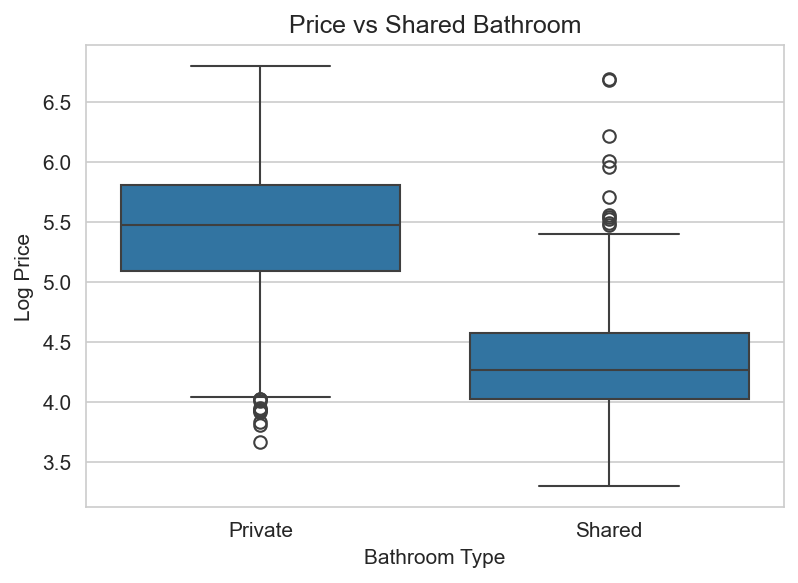

| Bathroom Type | Count | Mean Log Price | Median Log Price |
|---------------|------:|---------------:|-----------------:|
| Private (0)   | 2745  | 5.456          | 5.472            |
| Shared (1)    | 671   | 4.318          | 4.263            |

Listings with shared bathrooms have significantly lower prices compared to those with private bathrooms.

This engineered feature is particularly valuable, as it captures an important qualitative aspect not reflected in the numeric bathroom count. As a result, `is_shared_bath` serves as a strong and interpretable predictor for the model.


### 3.9 Neighborhood Processing

#### a. Data Exploratio and Cleaning

The dataset contain 25 unique neighborhood. To ensure data consistency and correctness, we cross-checked these neighborhood names with official Boston neighborhood definitions (https://en.wikipedia.org/wiki/Neighborhoods_in_Boston). 

We observed that some categories represent subregions or very small areas (*South Boston Waterfront*, *Leather District*, *Longwood Medical Area*). To reduce sparsity and improve model robustness, we grouped these into their larger, more representative neighborhoods based on geographic proximity and domain knowledge (e.g., *South Boston Waterfront → South Boston*, *Leather District → Downtown*, *Longwood Medical Area → Fenway*).
 
After cleaning, the number of unique neighborhoods be 22, leading to a more balanced distribution while preserving meaningful geographic distinctions.

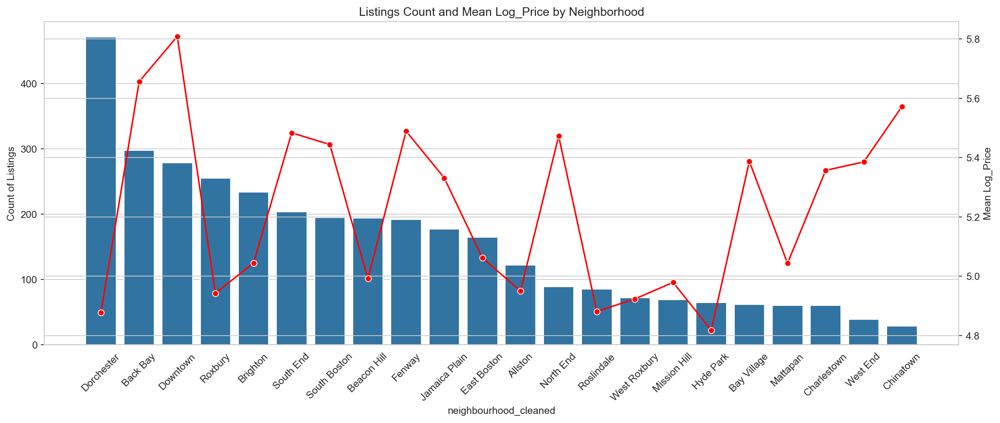


#### Neighborhood Summary

| Neighborhood       | Listings | Mean Price ($) | Mean Log Price |
|--------------------|---------:|---------------:|---------------:|
| Dorchester         | 471      | 175.02         | 4.878          |
| Back Bay           | 298      | 312.48         | 5.656          |
| Downtown           | 278      | 359.83         | 5.805          |
| Roxbury            | 255      | 186.86         | 4.943          |
| Brighton           | 234      | 182.58         | 5.045          |
| South End          | 203      | 262.90         | 5.477          |
| Beacon Hill        | 194      | 172.03         | 4.992          |
| South Boston       | 194      | 270.75         | 5.437          |
| Fenway             | 192      | 262.96         | 5.489          |
| Jamaica Plain      | 177      | 262.06         | 5.332          |
| East Boston        | 165      | 183.44         | 5.062          |
| Allston            | 122      | 186.26         | 4.950          |
| North End          | 89       | 280.04         | 5.473          |
| Roslindale         | 85       | 160.36         | 4.881          |
| West Roxbury       | 72       | 182.13         | 4.924          |
| Mission Hill       | 69       | 172.35         | 4.979          |
| Hyde Park          | 65       | 146.40         | 4.818          |
| Bay Village        | 62       | 253.03         | 5.388          |
| Mattapan           | 60       | 196.43         | 5.044          |
| Charlestown        | 60       | 258.33         | 5.357          |
| West End           | 38       | 250.76         | 5.348          |
| Chinatown          | 29       | 297.31         | 5.572          |


## 4. Amenities Parsing

The raw `amenities` column stores a JSON-like list string (e.g., `'["Wifi", "Kitchen", "Air conditioning"]'`). Each listing's amenities were parsed and the following binary flags and count were extracted:

| Feature | Pattern matched |
|---|---|
| `amenities_count` | Total number of comma-separated items |
| `has_wifi` | `wifi`, `wi-fi` |
| `has_parking` | `parking`, `garage`, `free street parking` |
| `has_kitchen` | `kitchen` |
| `has_ac` | `air conditioning`, `central air` |
| `has_workspace` | `dedicated workspace` |
| `has_self_checkin` | `self check-in` |


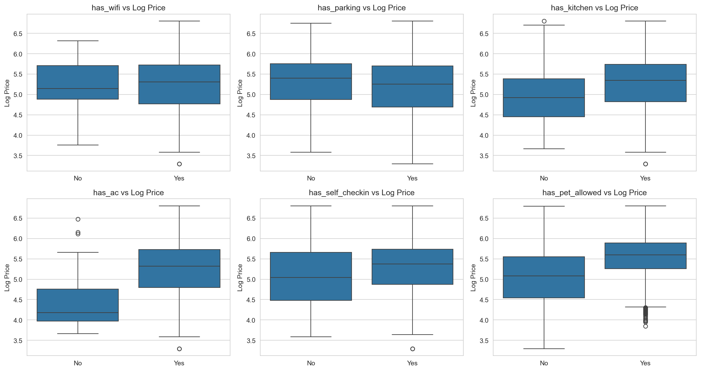


## 5. Geographic Clustering
